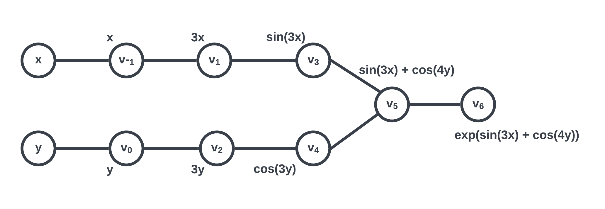

# Documentation

## Introduction

Automatic differentiation (AD) is a method to evaluate derivatives of functions at a given point of estimate by using the chain rule step by step.

Being one of the most fundamental operations in mathematics, differentiation is the process of finding a derivative by measuring the rate of change of a function with respect to a variable. Computational techniques of calculating differentiations have broad applications in many fields including science and engineering which are used in finding a numerical solution of ordinary differential equations, optimization, and solution of linear systems. 

There are three popular ways to calculate the derivative:
	1. Numerical Differentiation: Finite Difference
	2. Symbolic Differentiation
	3. Automatic Differentiation

Symbolic differentiation is precise, but it can lead to inefficient code and can be costly to evaluate. The finite difference is quick and easy to implement, but it is prone to round-off error, the loss of precision due to computer rounding of decimal quantities, and truncation error, the difference between the exact solution of the original differential equation. Automatic differentiation is more efficient than two of the other methods mentioned prior. While it utilizes the concept of dual numbers to achieve accuracy better than numeric differentiation, it is also more computationally efficient than symbolic differentiation, and therefore is widely used. 

In this library, the general mathematical background and concepts of differentiation as well as automatic differentiation are introduced in the Background section. A basic demo to use the package, software organization, and implementation of the forward mode of automatic differentiation are introduced below.

## Background


**1. Basic Calculus**

   * Product Rule

     Product rule is a formula used to find the derivative of the products of two or more functions. The product rule can be expressed as:

     $$\frac{\partial}{\partial x} (uv) = u \frac{\partial v}{\partial x} + v \frac{\partial u}{\partial x}.$$

   * Chain Rule

     Chain rule is a formula to compute the derivative of a composite function. 
     Suppose $y$ is a function of $u$. Then, the derivative of $y$ with respect to $x$ can be expressed using the chain rule as:

	  $$\frac{\partial y}{\partial x} = \frac{\partial y}{\partial u} \frac{\partial u}{\partial x}.$$

**2. Dual Numbers**
	
* A dual number consists of two parts: *real* (denoted as a) and *dual* (b), 
	usually written as
	$$z = a + b\epsilon,$$
	where $\epsilon \neq 0$ is a nilpotent number with the property $\epsilon^2 = 0$.

**3. Automatic Differentiation**

   * Automatic differentiation refers to a general way of taking a program that computes a value and automatically constructing a procedure for computing derivatives of that value. The derivatives sought may be first order (the gradient of a target function, or the Jacobian of a set of constraints), higher order (Hessian times direction vector or a truncated Taylor series), or nested. There are two modes in automatic differentiation: forward mode and reverse mode. In the current package, only the forward mode is focused and implemented.


   * *Evaluation Trace of a Function*: All numeric evaluations are sequences of elementary operations. The evaluation of $f$ at a given point $x = (x_1, \dots, x_n)$ can be described by a so-called evaluation trace $v_{k-m}=x_k$, for $k = 1,2, \dots, m$, where each intermediate result $v_j$ is a function that depends on the independent variable $x$. 
  

   * *Elementary functions*: The set of elementary functions has to be given and can, in principle, consist of arbitrary functions as long as these are sufficiently often differentiable. All elementary functions will be implemented in the system together with their gradients.


**4. Forward Mode of Automatic Differentiation**

   * Forward mode automatic differentiation divides the expression into a sequence of differentiable elementary operations. The chain rule and well-known differentiation rules are then applied to each elementary operation.

   * Forward mode automatic differentiation computes a tangent trace of the directional derivative $$D_p v_j = (\nabla y_i)^T p = \sum_{j=1}^{m} \frac{\partial y_i}{x_j} p_j$$ 
   for each intermediate variable $v_j$ at the same time as it performs a forward evaluation trace of the elementary pieces of a complicated $f(x)$ from the inside out. 
   Note that the vector $p$ is called the seed vector which gives the direction of the derivative.

   * Implementation with dual numbers: by its properties, a dual number can encode the primal trace and the tangent trace in the real and dual parts, respectively.
  
   $$z_j = v_j + D_p v_j \epsilon$$
   

In the most general case, a function can have more than one coordinate. To evaluate this function, we would take the sum of the partial derivatives with respect to each coordinate. For example, consider a function $f(u(t), v(t))$. If we first apply the chain rule to each coordinate, we have:
$$\frac{\partial f}{\partial t} = \frac{\partial f}{\partial u} \frac{\partial u}{\partial t} + \frac{\partial f}{\partial v} \frac{\partial v}{\partial t}$$

At a lower level, the implementation of AD requires breaking down the original function into smaller pieces known as elementary functions. For instance, consider the function
$$f(x, y) = \exp(\sin(3x) + \cos(4y))$$
Then, $f$ can be broken down into five elementary functions:

$$
\begin{align}
	g_1(z) &= 3z, \\
	g_2(z) &= 4z, \\
	g_3(z) &= \sin(z), \\
	g_4(z) &= \cos(z), \\
	g_5(z) &= \exp(z). \\
\end{align}
$$


Furthermore, the order of evaluating these elementary functions can be organized into a computational graph:



Note that the subsequent node $v_i$ stores the intermediate result of evaluating each elementary function. After evaluating each $v_i$, we have a sequence of intermediate results $v_1$ to $v_8$; this is called the primal trace. Similarly, following the computational graph, if we instead evaluate the derivative at each step, the resulting sequence would be called the dual trace. Such is essentially the procedure of forward mode automatic differentiation. 


## How to use team20ad

Create a conda environment to prevent conflicts with other operating system's packages:

`conda create -p ./conda-env python=3.9`

To activate the conda environment:

`conda activate ./conda-env`

Upgrade pip before installing the package:

`python3 -m pip install --upgrade pip`

the package is distributed through the test Python Package Index (PyPI), and hence the user can install it with:

`python3 -m pip install --index-url https://test.pypi.org/simple/ --no-deps team20-ad`

In addition, they need to install and import the dependable package `numpy`.

`python3 -m pip install numpy`

### Using the Package

With `team20ad` package installed, one can import the module by:

```python
>>> from team20ad.forwardAD import * #import team20ad
```

The user will be able to instantiate an `ad` object and compute the differentiation as follows:

Example of finding a derivative of a scalar function of a scalar:

```python
>>> x = DualNumber(4,1) # Derivative computation for a univariate scalar functions
>>> f = 3*x**2 + 4 # function to be differentiated
>>> f.real
53
>>> f.dual
24
>>> x = {'x': 4}
>>> f = ['3*x**2 + 4']  # input f should be a list of strings
>>> ad = ForwardAD(x, f) # compute derivative of f evaluated at x using forward mode AD
>>> ad()
===== Forward AD =====
Vars: {'x': 4}
Funcs: ['3*x**2 +4']
-----
Func evals: [52]
Gradient:
[[24.]]
```

Example of finding derivatives of a vector function of a vector:

```python
>>> f = ['x**2 + y**2', 'exp(x + y)'] # functions to be differentiated
>>> x = {'x': 1, 'y': 1} # values to evaluate
>>> ad = ForwardAD(x, f) # compute derivative of f evaluated at x using forward mode AD
>>> ad() 
===== Forward AD =====
Vars: {'x': 1, 'y': 1}
Funcs: ['x**2 + y**2', 'exp(x + y)']
-----
Func evals: [2, 7.38905609893065]
Gradient:
[[2.		2.		]
 [7.3890561	7.3890561]]
```

## Software Organization

### Directory structure

For now, at this phase of the project, our software directory is tentatively structured as follows:

```
team20/
|-- docs/
|  |-- milestone1.md
|  |-- milestone1.pdf
|  |-- milestone2.md
|  \-- milestone2_progress.md
|-- LICENSE
|-- README.md
|-- pyproject.toml
|-- install_package.sh
|-- .github/workflows/
|	|-- coverage.yml
|	\-- test.yml
|-- tests/
|	|-- check_coverage.sh
|	|-- test_codes/
|	|  |--  __init__.py
|	|  |--  test_forwardAD.py
|	|  |--  test_dualNumber.py
|	|  \--  test_elementary.py
\-- src/
	\-- team20ad/
	  |--	__init__.py
 	  |--	__main__.py
 	  |--	example.py
 	  |-- forwardAD.py
 	  |--	dualNumber.py
 	  \--	elementary.py
```
### Basic Modules and Functionality

Currently, we have three modules: one for implementing the forward mode of automatic differentiation and the other two for implementing `DualNumber` class and their elementary function overloads (more on this under the Implementation section).
Note that an implementation of the computational graph is optional for forward mode AD.

As such, we have corresponding tests `test_forwardAD.py`, `test_dualNumber.py`, and `test_elementary.py`, which are located under the `tests/test_codes` directory and which are configured to run automatically using GitHub workflows after each push to the `main` branch of development. 

As the development progresses, we expect the directory structure to change and the documentation to update accordingly.

Considering that the whole scheme of auto-differentiating will rely heavily on mathematical computations, the package requires `numpy` modules for implementations and calculations.

### Packaging

Our package is distributed using test PyPI following PEP517/PEP518. Details on how to install the package are written in *How to use team20ad* section above.


## Implementation

The first class we need is the `DualNumber` class which will serve as the lower-level structure of the forward AD class implementation. This class implements basic function overloaders such as `__add__()` and their reverse counterparts such as `__radd__()`. The full list of functions is provided below.
Along with the `DualNumber` class, we implement additional elementary function overloads in `elementary.py` which consists of exponential and trigonometric functions (please see the full list below). Note that these two modules support only operations on `DualNumber`, `int`, and `float` objects.
Then, we implement the `ForwardAD` class which serves as a function decoration for computing the derivatives.

The current name attributes and methods for each module are listed below:

- ForwardAD:
	- External dependencies: `numpy`
	- Name attribute: 
		- `Dpf`: the directional derivative of the function(s) to be evaluated
		- `var_dict`: a dictionary of variables and their corresponding values
		- `func_list`: a list of functions encoded as strings
	- Methods: 
		- `__init__`: Constructor for ForwardAD objects 
		- `__call__`: Caller method for ForwardAD objects
- DualNumber:
	- External dependencies: `numpy`
	- Name attributes: 
		- `real`: real part of a dual number
		- `dual`: dual part of a dual number
		- `_supported_scalars`: a list of supported scalar types
	- Methods: 
		- `__init__`: Constructor for DualNumber objects
		- `__repr__`: Returns a string representation for a DualNumber object
		- `__str__`: Returns a formatted string representation for a DualNumber object
		- `__neg__`: Operates the negation operation.
		- `__add__`: Computes the summation operation between DualNumber and supported scalar objects.
		- `__radd__`: Same method as `__add__` with reversed operands.
		- `__sub__`: Computes the subtraction operation between DualNumber and supported scalar objects.
		- `__rsub__`: Same method as `__sub__` with reversed operands.
		- `__mul__`: Computes the multiplication operation between DualNumber and supported scalar objects.
		- `__rmul__`: Same method as `__mul__` with reversed operands.
		- `__truediv__`: Computes the true division operation between DualNumber and supported scalar objects.
		- `__rtruediv__`: Same method as `__truediv__` with reversed operands.
		- `__pow__`: Computes the power rule on a DualNumber object.
		- `__rpow__`: Same method as `__pow__` with reversed operands.
		- `__eq__`: Operates the equal comparison.
		- `__ne__`: Operates the not equal comparison.
		- `__lt__`: Operates the less than comparison.
		- `__gt__`: Operates the greater than comparison.
		- `__le__`: Operates the less than or equal to comparison.
		- `__ge__`: Operates the greater than or equal to comparison.
		- `__abs__`: Computes the absolute values on both real and dual parts.
- elementary: Methods: 
		- External dependencies: `numpy`
   	- `sqrt`: Computes the square root of a given value.
   	- `exp`: Computes the exponential of a given value. 
   	- `log`: Computes the logarithm of a given value.
   	- `sin`: Computes the sine of a given value.
   	- `cos`: Computes the cosine of a given value.
   	- `tan`: Computes the tangent of a given value.
   	- `arcsin`: Computes the arcsine (inverse sine) of a given value.
   	- `arccos`: Computes the arccosine (inverse cosine) of a given value.
   	- `arctan`: Computes the arctangent (inverse tangent) of a given value.
   	- `sinh`: Computes the hyperbolic sine of a given value.
   	- `cosh`: Computes the hyperbolic cosine of a given value.
   	- `tanh`: Computes the hyperbolic tangent of a given value.

As for the handling of $f: \mathbb{R}^m -> \mathbb{R}$ and $f: \mathbb{R}^m -> \mathbb{R}^n$, we will have a high-level function object in form of vectors to compute the Jacobian.
These vectors will be represented by `numpy` arrays.

The implementation of forward mode AD is mostly completed. Going forward, we will
focus on reverse mode AD, which will require the implementation of a computational graph.

## Future Features

In addition to the forward mode, our group will implement reverse mode because forward mode can be computationally expensive to calculate the gradient of a large complicated function of many variables. The reverse mode uses an extension of the forward mode computational graph to enable the computation of a gradient by a reverse traversal of the graph. 
 
 In the future, the software structure will be adjusted to accommodate changes for reverse AD implementation as follows:

 ```
team20/
|-- docs/
|  |-- milestone1.md
|  |-- milestone1.pdf
|  |-- milestone2.md
|  |-- milestone2_progress.md
|  \-- final.md
|-- LICENSE
|-- README.md
|-- pyproject.toml
|-- install_package.sh
|-- .github/workflows/
|	|-- coverage.yml
|	\-- test.yml
|-- tests/
|	|-- check_coverage.sh
|	|-- test_codes/
|	|  |--  __init__.py
|	|  |--  test_forwardAD.py
|	|  |--  test_reverseAD.py
|	|  |--  test_graph.py
|	|  |--  test_dualNumber.py
|	|  \--  test_elementary.py
\-- src/
	\-- team20ad/
	  |--	__init__.py
 	  |--	__main__.py
 	  |--	example.py
 	  |-- forwardAD.py
 	  |-- reverseAD.py
 	  |-- graph.py
 	  |--	dualNumber.py
 	  \--	elementary.py
```

We will have two additional modules: one for computing the derivatives through reverse mode AD and the other for `ComputationalGraph` class. In addition, we will have the associated test modules for these two: `test_reverseAD.py` and `test_graph.py`. Thus, the user must decide which mode of AD to be used for computation at the time of module import.

For forward mode AD, use:

```python
>>> from team20ad.forwardAD import * 
```

For reverse mode AD, use:

```python
>>> from team20ad.reverseAD import * 
```

We expect the changes to be minimal and stay within what is indicated above.


