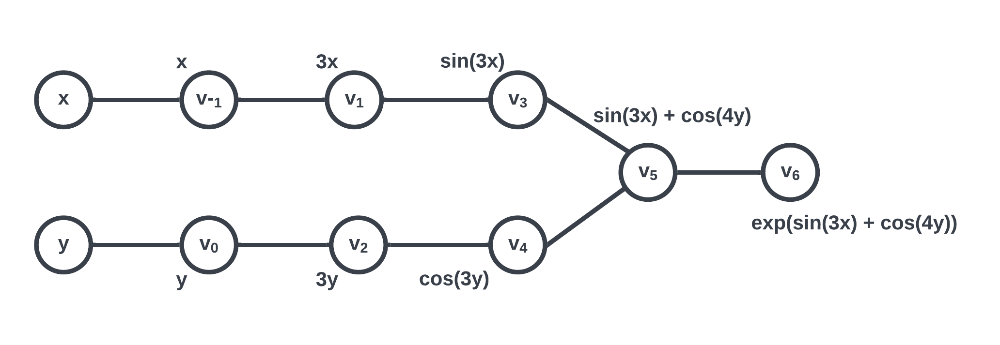

# Documentation

## Introduction

Automatic differentiation (AD) is a method to evaluate derivatives of functions at a given point of estimate by using the chain rule step by step.

Being one of the most fundamental operations in mathematics, differentiation is the process of finding a derivative by measuring the rate of change of a function with respect to a variable. Computational techniques of calculating differentiations have broad applications in many fields including science and engineering which are used in finding a numerical solution of ordinary differential equations, optimization, and solution of linear systems. 

There are three popular ways to calculate the derivative:
	1. Numerical Differentiation: Finite Difference
	2. Symbolic Differentiation
	3. Automatic Differentiation

Symbolic differentiation is precise, but it can lead to inefficient code and can be costly to evaluate. The finite difference is quick and easy to implement, but it is prone to round-off error, the loss of precision due to computer rounding of decimal quantities, and truncation error, the difference between the exact solution of the original differential equation. Automatic differentiation is more efficient than two of the other methods mentioned prior. While it utilizes the concept of dual numbers to achieve accuracy better than numeric differentiation, it is also more computationally efficient than symbolic differentiation, and therefore is widely used. 

In this library, the general mathematical background and concepts of differentiation as well as automatic differentiation are introduced in the Background section. A basic demo to use the package, software organization, and implementations of forward and reverse mode automatic differentiation are introduced below.

## Background


**1. Basic Calculus**

   * Product Rule

     Product rule is a formula used to find the derivative of the products of two or more functions. The product rule can be expressed as:

     $$\frac{\partial}{\partial x} (uv) = u \frac{\partial v}{\partial x} + v \frac{\partial u}{\partial x}.$$

   * Chain Rule

     Chain rule is a formula to compute the derivative of a composite function. 
     Suppose $y$ is a function of $u$. Then, the derivative of $y$ with respect to $x$ can be expressed using the chain rule as:

	  $$\frac{\partial y}{\partial x} = \frac{\partial y}{\partial u} \frac{\partial u}{\partial x}.$$

**2. Dual Numbers**
	
* A dual number consists of two parts: *real* (denoted as a) and *dual* (b), 
	usually written as
	$$z = a + b\epsilon,$$
	where $\epsilon \neq 0$ is a nilpotent number with the property $\epsilon^2 = 0$.

**3. Automatic Differentiation**

   * Automatic differentiation refers to a general way of taking a program that computes a value and automatically constructing a procedure for computing derivatives of that value. The derivatives sought may be first order (the gradient of a target function, or the Jacobian of a set of constraints), higher order (Hessian times direction vector or a truncated Taylor series), or nested. There are two modes in automatic differentiation: forward mode and reverse mode, both of which are supported in this package.


   * *Evaluation Trace of a Function*: All numeric evaluations are sequences of elementary operations. The evaluation of $f$ at a given point $x = (x_1, \dots, x_m)$ can be described by a so-called evaluation trace $v_{k-m}=x_k$, for $k = 1,2, \dots, m$, where each intermediate result $v_j$ is a function that depends on the independent variable $x$. 
  

   * *Elementary functions*: The set of elementary functions has to be given and can, in principle, consist of arbitrary functions as long as these are sufficiently often differentiable. All elementary functions will be implemented in the system together with their gradients.
   

   * The implementation of AD requires breaking down the original function into elementary functions. For instance, consider the function
   $$f(x, y) = \exp(\sin(3x) + \cos(4y)).$$ The function $f$ can be decomposed into six elementary functions:

$$
\begin{align}
v_1 &= 3x, \\
v_2 &= 4y, \\
v_3 &= \sin(v_1), \\
v_4 &= \cos(v_2), \\
v_5 &= v_3 + v_4, \\
v_6 &= \exp(v_5).
\end{align}
$$

   * Furthermore, the order of evaluating these elementary functions can be illustrated as a computational graph:

   

   * Note that the nodes $v_i$ are called intermediate results. After evaluating each $v_i$, we have a sequence of intermediate results $v_{-1}$ to $v_6$; this is called the *primal trace*. Similarly, traversing the computational graph, if we instead evaluate the derivative at each step, the resulting sequence would be called the *dual trace*. Such is essentially the procedure of forward mode automatic differentiation. 


**4. Forward Mode of Automatic Differentiation**

   * Forward mode automatic differentiation divides the expression into a sequence of differentiable elementary operations. The chain rule and well-known differentiation rules are then applied to each elementary operation.

   * Forward mode automatic differentiation computes a tangent trace of the directional derivative $$D_p v_j = (\nabla y_i)^T p = \sum_{j=1}^{m} \frac{\partial y_i}{\partial x_j} p_j$$ 
   for each intermediate variable $v_j$ at the same time as it performs a forward evaluation trace of the elementary pieces of a complicated $f(x)$ from the inside out. 
   Note that the vector $p$ is called the seed vector which gives the direction of the derivative.

   * Forward mode automatic differentiation can be implemented using the concept of dual numbers. By its properties, a dual number can encode the primal trace and the tangent trace in the real and dual parts, respectively.
  
   $$z_j = v_j + D_p v_j \epsilon$$

**5. Reverse Mode of Automatic Differentiation**

   * Reverse mode automatic differentiation is a 2-pass process. The first pass called *forward pass* traverses the computational graph forward and computes the primal trace $v_j$ as well as its partial derivative $\frac{\partial v_j}{\partial v_i}$ with respect to its parent node(s) $v_i$. 
   * The other pass called *reverse pass* computes for each node $i$ an adjoint $\bar{v}_i$ which is given by the sum $\bar{v}_j \cdot \frac{\partial v_j}{\partial v_i}$ over all child $j$ of $i$.
   * Observe that $\frac{\partial v_j}{\partial v_i}$ is computed during the forward pass.
   * The reverse pass initializes all adjoints to be zero, except those that have no children which will be assigned a value of $1$. It then accumulates the adjoints with the following update rule as it iterates over all children $j$ of node $i$: $$\bar{v}_i \leftarrow \bar{v}_i + \bar{v}_j \cdot \frac{\partial v_j}{\partial v_i}.$$
   * The reverse pass will proceed to update the parent(s) of node $i$ only if their children's adjoint computation has been completed. Thus, the reverse mode automatic differentiation requires a computational graph to be stored.
   * Finally, the derivatives of $f$ with respect to the independent variable $x$ can be obtained from the first $m$ adjoints.

   
**6. Differences Between Forward and Reverse Modes**
   * Forward mode of automatic differentiation computes the gradient with respect to the independent variables $\nabla_x f$ whereas reverse mode computes the gradient with respect to the coordinates $v$, $\nabla_v f$. Thus, the gradient $\nabla_x f$ is a subset of $\nabla_v f$.
   * Forward mode doesn't require a computational graph to be stored but its computational cost is dependent on the number of independent variables.
   * The computational cost of reverse mode is entirely independent of the number of independent variables but it does require to storing a computational graph.
   * Therefore, it is recommended to use forward mode AD when the number of outputs greatly exceeds the number of independent variables; and use reverse mode AD, otherwise.


## How to use team20ad

### Installation

An important note is that the package requires Python (>= 3.9) (See https://www.python.org/downloads/ for installation).

Create a venv environment to prevent conflicts with other operating system's packages:

`python3 -m venv ./env`

To activate the venv environment:

`source ./env/bin/activate`

Upgrading pip before installing the package is highly recommended:

`python3 -m pip install --upgrade pip`

The package `team20ad` is distributed through the test Python Package Index (PyPI), and hence one can install it with pip:

`python3 -m pip install -i https://test.pypi.org/simple/ team20-ad==0.0.5`

In addition, the package requires a dependable package `numpy`:

`python3 -m pip install numpy`


### Using the Package

Two modes of automatic differentiation are supported in this package: forward and
reverse modes. With `team20ad` package installed, one can import the module with:

```python
>>> from team20ad.wrapperAD import *  # import wrapper class
```

and instantiate an `AD` object to compute the differentiation as follows:

```python
>>> var_dict = {'x': 1, 'y': 2}
>>> func_list = ['x**2 + y**2', 'exp(x + y)', 'tan(x + y) * sqrt(y)']
>>> ad = AD(var_dict, func_list)
Number of variables <= number of functions: forward mode by default.
>>> ad()
===== Forward AD =====
Vars: {'x': 1, 'y': 2}
Funcs: ['x**2 + y**2', 'exp(x + y)', 'tan(x + y) * sqrt(y)']
-----
Func evals: [5, 20.085536923187668, -0.20159125448504428]
Gradient:
[[ 2.          4.        ]
 [20.08553692 20.08553692]
 [ 1.4429497   1.39255189]]
```

In the above example, forward mode is automatically chosen because the
number of variables is less than or equal to the number of functions to evaluate.
Otherwise, one can specify the mode of automatic differentiation as follows:

```python
>>> ad = AD(var_dict, func_list, mode = "reverse") # select reverse mode manually
>>> ad()
===== Reverse AD =====
Vars: {'x': 1, 'y': 2}
Funcs: ['x**2 + y**2', 'exp(x + y)', 'tan(x + y) * sqrt(y)']
-----
Func evals: [5.0, 20.085536923187668, -0.20159125448504428]
Derivatives:
[[ 2.          4.        ]
 [20.08553692 20.08553692]
 [ 1.4429497   1.39255189]]
```

Note that options for `mode` include "forward" or "f" for forward mode, and "reverse" or "r" for reverse mode.

If `mode` is not specified by the user and the number of variables is greater than that of functions, then reverse mode is automatically chosen as shown in the following example:

```python
>>> v = {'x': 1, 'y': 2, 'z': 3}
>>> f = 'tan(x) + exp(y) + sqrt(z)'
>>> ad = AD(v, f)
Number of variables > number of functions: reverse mode by default.
>>> ad()
===== Reverse AD =====
Vars: {'x': 1, 'y': 2, 'z': 3}
Funcs: ['tan(x) + exp(y) + sqrt(z)']
-----
Func evals: [10.67851463115443]
Derivatives:
[[3.42551882 7.3890561  0.28867513]]
```

Furthermore, besides reading the output, a user can access the results directly from the `AD` object. Here's how it's done:

```python
>>> v = {'x': 1, 'y': 2, 'z': 3}
>>> f = 'tan(x) + exp(y) + sqrt(z)'
>>> ad = AD(v, f)
Number of variables > number of functions: reverse mode by default.
>>> ad.func_evals  # function evaluations
[10.67851463115443]
>>> ad.Dpf  # the final gradient matrix
array([[3.42551882, 7.3890561 , 0.28867513]])
```

For completeness, we will demonstrate that our implementation works on any combination of variable set and function list of various sizes.

***Case: Forward mode, 1 variable, 1 funtion***

```python
>>> v = {'x': 1}
>>> f = 'sin(x) + cos(x)'
>>> ad = AD(v, f, mode='f')
>>> ad()
===== Forward AD =====
Vars: {'x': 1}
Funcs: ['sin(x) + cos(x)']
-----
Func evals: [1.3817732906760363]
Gradient:
[[-0.30116868]]
```

***Case: Forward mode, 1 variable, multiple funtions***

```python
>>> v = {'x': 1}
>>> f = ['sin(x)', 'cos(x)', 'exp(sqrt(tan(x)))']
>>> ad = AD(v, f, mode='f')
>>> ad()
===== Forward AD =====
Vars: {'x': 1}
Funcs: ['sin(x)', 'cos(x)', 'exp(sqrt(tan(x)))']
-----
Func evals: [0.8414709848078965, 0.5403023058681398, 3.4832348880897035]
Gradient:
[[ 0.54030231]
 [-0.84147098]
 [ 4.78055107]]
```

***Case: Forward mode, multiple variables, 1 funtion***

```python
>>> v = {'x': 1, 'y': 2, 'z': 3}
>>> f = 'tan(x) + exp(y) + sqrt(z)'
>>> ad = AD(v, f, mode='f')
>>> ad()
===== Forward AD =====
Vars: {'x': 1, 'y': 2, 'z': 3}
Funcs: ['tan(x) + exp(y) + sqrt(z)']
-----
Func evals: [10.67851463115443]
Gradient:
[[3.42551882 7.3890561  0.28867513]]
```

***Case: Forward mode, multiple variables, multiple functions***

```python
>>> v = {'x': 1, 'y': 2}
>>> f = ['x**2 + y**2', 'exp(x + y)', 'tan(x + y) * sqrt(y)']
>>> ad = AD(v, f, mode='f')
>>> ad()
===== Forward AD =====
Vars: {'x': 1, 'y': 2}
Funcs: ['x**2 + y**2', 'exp(x + y)', 'tan(x + y) * sqrt(y)']
-----
Func evals: [5, 20.085536923187668, -0.20159125448504428]
Gradient:
[[ 2.          4.        ]
 [20.08553692 20.08553692]
 [ 1.4429497   1.39255189]]
```

***Case: Reverse mode, 1 variable, 1 funtion***

```python
>>> v = {'x': 1}
>>> f = 'sin(x) + cos(x)'
>>> ad = AD(v, f, mode='r')
>>> ad()
===== Reverse AD =====
Vars: {'x': 1}
Funcs: ['sin(x) + cos(x)']
-----
Func evals: [1.3817732906760363]
Derivatives:
[[-0.30116868]]
```

***Case: Reverse mode, 1 variable, multiple funtions***

```python
>>> v = {'x': 1}
>>> f = ['sin(x)', 'cos(x)', 'exp(sqrt(tan(x)))']
>>> ad = AD(v, f, mode='r')
>>> ad()
===== Reverse AD =====
Vars: {'x': 1}
Funcs: ['sin(x)', 'cos(x)', 'exp(sqrt(tan(x)))']
-----
Func evals: [0.8414709848078965, 0.5403023058681398, 3.4832348880897035]
Derivatives:
[[ 0.54030231]
 [-0.84147098]
 [ 4.78055107]]
```

***Case: Reverse mode, multiple variables, 1 funtion***

```python
>>> v = {'x': 1, 'y': 2, 'z': 3}
>>> f = 'tan(x) + exp(y) + sqrt(z)'
>>> ad = AD(v, f, mode='r')
>>> ad()
===== Reverse AD =====
Vars: {'x': 1, 'y': 2, 'z': 3}
Funcs: ['tan(x) + exp(y) + sqrt(z)']
-----
Func evals: [10.67851463115443]
Derivatives:
[[3.42551882 7.3890561  0.28867513]]
```

***Case: Reverse mode, multiple variables, multiple functions***

```python
>>> v = {'x': 1, 'y': 2}
>>> f = ['x**2 + y**2', 'exp(x + y)', 'tan(x + y) * sqrt(y)']
>>> ad = AD(v, f, mode='r')
>>> ad()
===== Reverse AD =====
Vars: {'x': 1, 'y': 2}
Funcs: ['x**2 + y**2', 'exp(x + y)', 'tan(x + y) * sqrt(y)']
-----
Func evals: [5.0, 20.085536923187668, -0.20159125448504428]
Derivatives:
[[ 2.          4.        ]
 [20.08553692 20.08553692]
 [ 1.4429497   1.39255189]]
```

At the end of their workflow, if the user wishes to quit the virtual environment, issue the following command:

`deactivate`


## Software Organization

### Directory structure

The software directory is structured as follows:

```
team20/
|-- docs/
|  |-- documentation.md
|  |-- milestone1.md
|  |-- milestone1.pdf
|  |-- milestone2.md
|  \-- milestone2_progress.md
|-- LICENSE
|-- README.md
|-- pyproject.toml
|-- install_package.sh
|-- .github/workflows/
|	|-- coverage.yml
|	\-- test.yml
|-- tests/
|	|-- check_coverage.sh
|	|-- test_codes/
|	|  |--  __init__.py
|	|  |--  test_forward.py
|	|  |--  test_reverse.py
|	|  |--  test_reverse_node.py
|	|  |--  test_wrapper.py
|	|  |--  test_dualNumber.py
|	|  \--  test_elementary.py
\-- src/
	\-- team20ad/
	  |--	__init__.py
 	  |--	__main__.py
 	  |--	example.py
 	  |-- forwardAD.py
 	  |-- reverseAD.py
	  |-- wrapperAD.py
 	  |--	dualNumber.py
 	  \--	elementary.py
```

### Basic Modules and Functionality

There are five modules: three for implementing and supporting the forward mode of automatic differentiation, one for implementing the reverse mode AD, and the other one for a wrapper of both modes of AD.
The forward mode implementations contain two supporting modules: `DualNumber` class and 
operation overloadings defined in `elementary.py` (More details on these two modules can be found under the Implementation section). The reverse mode and the wrapper implementationss are described under the *Extension* Section below.

As such, we have corresponding tests `test_forward.py`, `test_reverse.py`, `test_reverse_node.py`, `test_wrapper.py`, `test_dualNumber.py`, and `test_elementary.py`, which are located under the `tests/test_codes` directory and which are configured to run automatically using GitHub workflows after each push to a git branch. 

For the package installation, please refer to the *How to use team20ad* Section. An important note is that the package requires `numpy` modules for implementations and calculations as
it relies heavily on fast and accurate mathematical computations.

### Packaging

Our package is distributed using test PyPI following PEP517/PEP518. Details on how to install the package are written in *How to use team20ad* Section above.


## Implementation

There are two parts of the implementations based on the modes of automatic differentiation. First, the forward mode requires the `DualNumber` class, which serves as the ground of function evaluation and derivative computation as described in detail in the *Background* Section. This module also implements basic function overloaders such as `__add__()` and their reverse counterparts such as `__radd__()`. The full list of methods is provided below.
In addition to the `DualNumber` class, the package contains additional elementary function overloads in `elementary.py` such as exponential and trigonometric functions (please see the full list below). Note that these two modules support only operations on `DualNumber`, `int`, and `float` objects.
At a higher level, the `ForwardAD` class serves as a user-interacting interface or wrapper for computing derivatives of a given function $f$ at a given value $x$.

### Extension

The second part of the package concerns the implementation of reverse mode
automatic differentiation as discussed in detail under the *Background* Section. 
The module contains two classes: one wrapper `ReverseAD`
and the other `Node` for constructing a computational graph. Similar to its counterpart,
`ReverseAD` takes only two arguments which are (a list of) function(s) encoded as string(s) and a dictionary of variable-value pairs to be evaluated at. Both wrappers `ForwardAD` and `ReverseAD` callers will print out the function evaluations and their derivatives in the same format as that of `numpy` arrays.

To enable greater user experience, a class `AD` written in `wrapperAD.py` wraps the implementations of the two modes. There is an option called `mode` in which a user can specify the mode of AD. If `mode` is left unspecified at the time of an instance's initialization, the program will automatically choose a mode based on the number of independent variables and the number of functions to differentiate. If the number of independent variables is greater than the number of functions, reverse mode will be computed by default. Otherwise, the differentiation will be completed under forward mode.

Note that both modes of automatic differentiation require an external dependency from `numpy`.

The name attributes and methods for each module are listed below:

- ForwardAD:
	- External dependency: `numpy`
	- Name attributes: 
		- `Dpf`: the directional derivative of the function(s) to be evaluated
		- `var_dict`: a dictionary of variables and their corresponding values
		- `func_list`: (a list of) function(s) encoded as string(s)
	- Methods: 
		- `__init__`: Constructor for ForwardAD objects 
		- `__call__`: Caller method for ForwardAD objects
- DualNumber:
	- External dependency: `numpy`
	- Name attributes: 
		- `real`: real part of a dual number
		- `dual`: dual part of a dual number
		- `_supported_scalars`: a list of supported scalar types
	- Methods: 
		- `__init__`: Constructor for DualNumber objects
		- `__repr__`: Returns a string representation for a DualNumber object
		- `__str__`: Returns a formatted string representation for a DualNumber object
		- `__neg__`: Operates the negation operation.
		- `__add__`: Computes the summation operation between DualNumber and supported scalar objects.
		- `__radd__`: Same method as `__add__` with reversed operands.
		- `__sub__`: Computes the subtraction operation between DualNumber and supported scalar objects.
		- `__rsub__`: Same method as `__sub__` with reversed operands.
		- `__mul__`: Computes the multiplication operation between DualNumber and supported scalar objects.
		- `__rmul__`: Same method as `__mul__` with reversed operands.
		- `__truediv__`: Computes the true division operation between DualNumber and supported scalar objects.
		- `__rtruediv__`: Same method as `__truediv__` with reversed operands.
		- `__pow__`: Computes the power rule on a DualNumber object.
		- `__rpow__`: Same method as `__pow__` with reversed operands.
		- `__eq__`: Operates the equal comparison.
		- `__ne__`: Operates the not equal comparison.
		- `__lt__`: Operates the less than comparison.
		- `__gt__`: Operates the greater than comparison.
		- `__le__`: Operates the less than or equal to comparison.
		- `__ge__`: Operates the greater than or equal to comparison.
		- `__abs__`: Computes the absolute values on both real and dual parts.
- elementary:  
	- External dependency: `numpy`
   - Methods:
   	- `sqrt`: Computes the square root of a given value.
   	- `exp`: Computes the exponential of a given value. 
   	- `log`: Computes the logarithm of a given value.
   	- `sin`: Computes the sine of a given value.
   	- `cos`: Computes the cosine of a given value.
   	- `tan`: Computes the tangent of a given value.
   	- `arcsin`: Computes the arcsine (inverse sine) of a given value.
   	- `arccos`: Computes the arccosine (inverse cosine) of a given value.
   	- `arctan`: Computes the arctangent (inverse tangent) of a given value.
   	- `sinh`: Computes the hyperbolic sine of a given value.
   	- `cosh`: Computes the hyperbolic cosine of a given value.
   	- `tanh`: Computes the hyperbolic tangent of a given value.
   	- `logistic`: Computes the logistic of the given value and parameters.
- ReverseAD: (Extension)
	- External dependency: `numpy`
	- Name attributes: 
		- `Dpf`: the derivative(s) of the function(s) to be evaluated
		- `var_dict`: a dictionary of variables and their corresponding values
		- `func_list`: (a list of) function(s) encoded as string(s)
	- Methods: 
		- `__init__`: Constructor for ReverseAD objects 
		- `__call__`: Caller method for ReverseAD objects
- Node: (Extension)
	- External dependency: `numpy`
	- Name attributes: 
		- `var`: a primal trace value to be stored at each node.
		- `child`: a list of all depending Nodes and their associated derivatives
		- `derivative`: the current adjoint
	- Methods: 
		- `__init__`: Constructor for Node objects
		- `__repr__`: Returns a string representation for a Node object
		- `__str__`: Returns a formatted string representation for a Node object
		- `g_derivatives`: Get derivatives for each variable in the function
		- `partial`: Computes the adjoint for the variable
		- `__neg__`: Returns a new node instance as the negation of the Node instance.
		- `__add__`: Returns a new Node instance as a result of the addition.
		- `__radd__`: Same method as `__add__` with reversed operands.
		- `__sub__`: Returns a new Node instance as a result of the subtraction.
		- `__rsub__`: Same method as `__sub__` with reversed operands.
		- `__mul__`: Returns a new Node instance as a result of the multiplication.
		- `__rmul__`: Same method as `__mul__` with reversed operands.
		- `__truediv__`: Returns a new Node instance as a result of the division.
		- `__rtruediv__`: Same method as `__truediv__` with reversed operands.
		- `__pow__`: Returns the exponential of the Node instance.
		- `__rpow__`: Same method as `__pow__` with reversed operands.
		- `__eq__`: Operates the equal comparison.
		- `__ne__`: Operates the not equal comparison.
		- `__lt__`: Operates the less than comparison.
		- `__gt__`: Operates the greater than comparison.
		- `__le__`: Operates the less than or equal to comparison.
		- `__ge__`: Operates the greater than or equal to comparison.
		- `__abs__`: Returns a new Node instance that has the absolute value.
		- `sqrt`: (static) Computes the square root of a given value.
   	- `exp`: (static) Computes the exponential of a given value. 
   	- `log`: (static) Computes the logarithm of a given value.
   	- `sin`: (static) Computes the sine of a given value.
   	- `cos`: (static) Computes the cosine of a given value.
   	- `tan`: (static) Computes the tangent of a given value.
   	- `arcsin`: (static) Computes the arcsine (inverse sine) of a given value.
   	- `arccos`: (static) Computes the arccosine (inverse cosine) of a given value.
   	- `arctan`: (static) Computes the arctangent (inverse tangent) of a given value.
   	- `sinh`: (static) Computes the hyperbolic sine of a given value.
   	- `cosh`: (static) Computes the hyperbolic cosine of a given value.
   	- `tanh`: (static) Computes the hyperbolic tangent of a given value.
   	- `logistic`: (static) Computes the logistic of the given value and parameters.      
- AD: (Extension)
   - Name attributes: 
      - `var_dict`: a dictionary of variables and their corresponding values
      - `func_list`: (a list of) function(s) encoded as string(s)
      - `mode`: string indicating mode of AD
      - `res`: AD object of a specified mode
   - Methods: 
      - `__init__`: Constructor for AD objects 
      - `__call__`: Caller method for AD objects


## Broader Impact and Inclusivity Statement

In a dynamic world, the ability to track change is essential in most academic fields. Our tool enables automatic differentiation (AD) to compute derivatives of functions ranging from simple to complex functions. Unlike conventional methods for evaluating derivatives (e.g., symbolic derivatives, finite differences) that are computationally expensive or lack accuracy/stability, AD enables us to calculate derivatives with machine precision without compromising accuracy and stability. We believe that this tool will be used in a wide range of applications where fast and accurate differential calculations, especially optimization, are needed.

The potential positive impact would be a contribution to energy savings by calculating complex derivatives with less computational energy. While AI and ML research improves human life, training complex models can take a substantial amount of temporal, financial, and environmental resources. Our tools, with their advantages of being efficient and environmental friendly, are aimed to tackle environmental and sustainable issues in computer science research, and ultimately create a positive impact on the climate. However, one possible negative impact is the misuse of our tools by students who are just starting to learn calculus. Because our tools are user-friendly, it can be convenient for students who do their homework and do not want to spend time figuring out questions manually. To prevent this potential issue, we will release an educational package with visual explanations of the calculations.

While our tools are user-friendly, it is developed under an assumption that the users have basic familiarity with python, calculus, and mathematical terminologies in English. It can, unfortunately, exclude a vast portion of our community who are not familiar with these concepts on are not fluent in English. To make our package more inclusive, we plan on launching a web-based extension of our package in which any user can enjoy our tool by simply entering their functions of interest and values. In addition, we plan to make this documentation available in other languages as well. 


## Future Work

This package has achieved to automatically calculate the derivatives in both forward and reverse modes. However, there are a few aspects that we could extend to make the package usage more useful for broader impacts.

**Second and Higher-Order Derivatives**
Currently, both of our forward mode and reverse mode implementations handle only the first derivative of functions. However, in some cases with real world problems, the estimation of second-order or higher-order derivatives is also necessary. We may approach the high-order derivatives with the Hessian matrix.

**Interface Usage**
To provide an easier approach to the package for users who have no coding background, we could extend our package with a more friendly user interface where one can specify variable values and functions which then would print out the final gradient and function values.

**Visualization**
In terms of understanding the process, now one can compute function values and derivatives of functions with the current package, but they do not see the calculation process behind. Visualizations of forward and reverse mode computations can be greatly helpful, especially for those who have little background on automatic differentiation. So one possible extension is to create a visualization tool to display the calculation process of forward and reverse modes.

**Direct Extension to Other Applications**
Our package can also extend to other applications like optimization and machine learning that require to compute gradients. For instance, we can create an optimizer with automatic differentiation and implement back-propagation in neural networks based on our package in the future.

